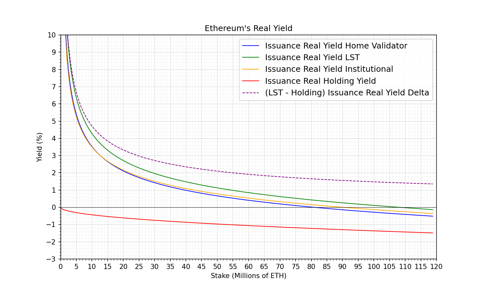
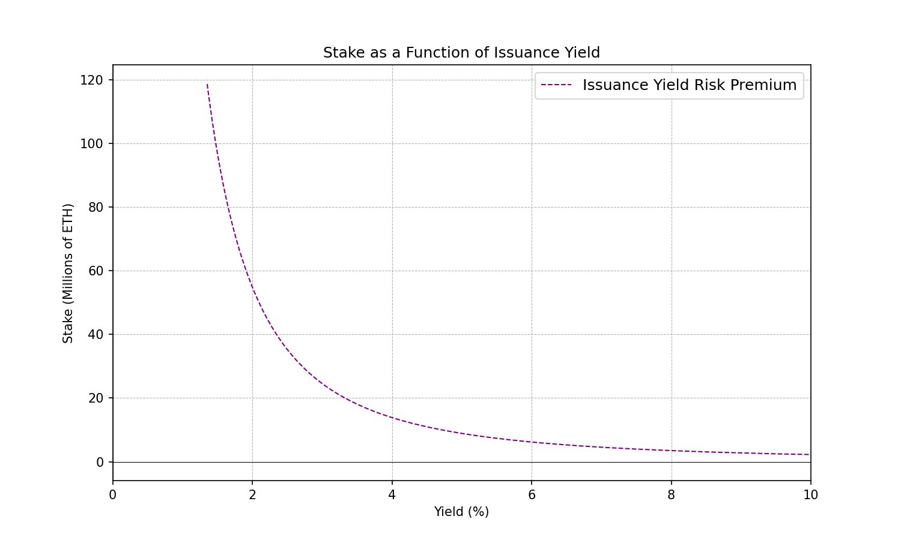
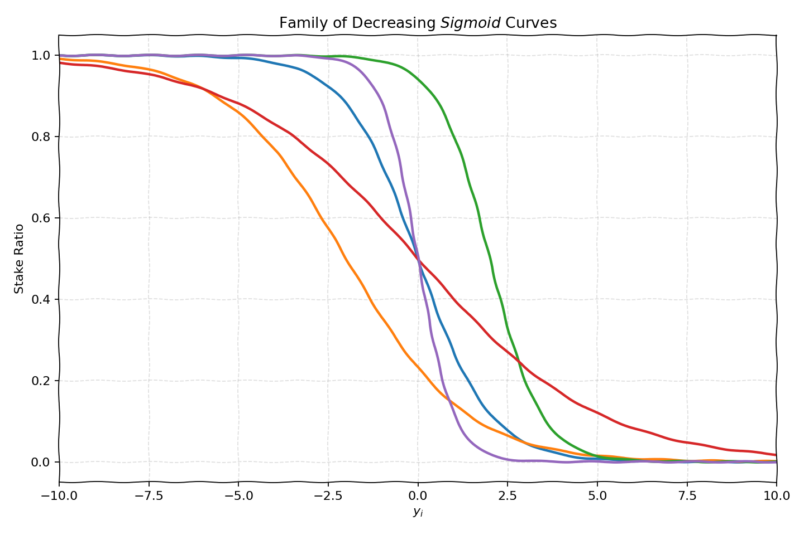
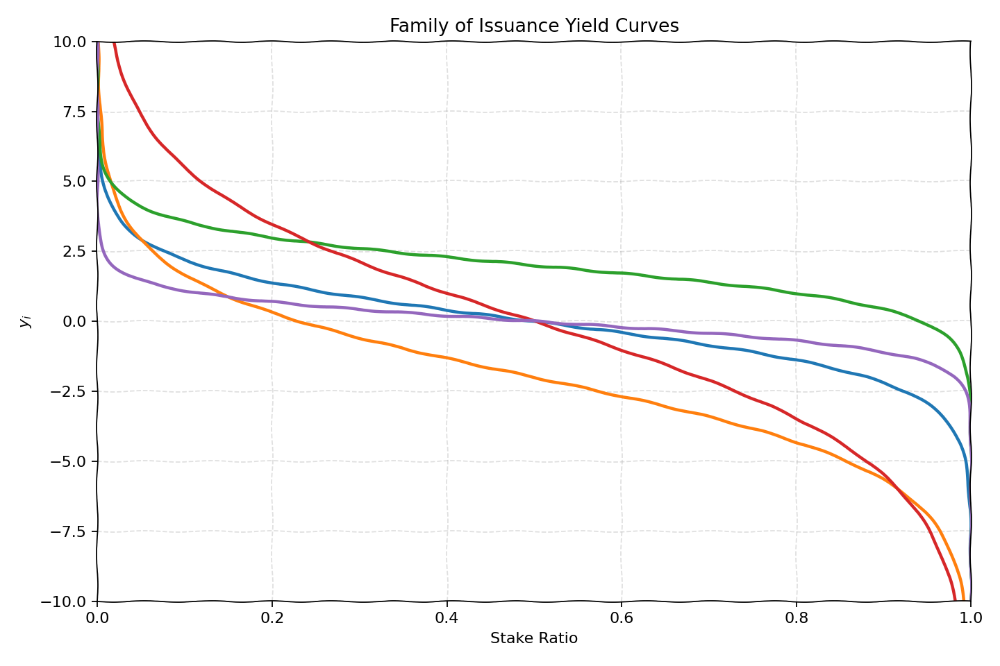
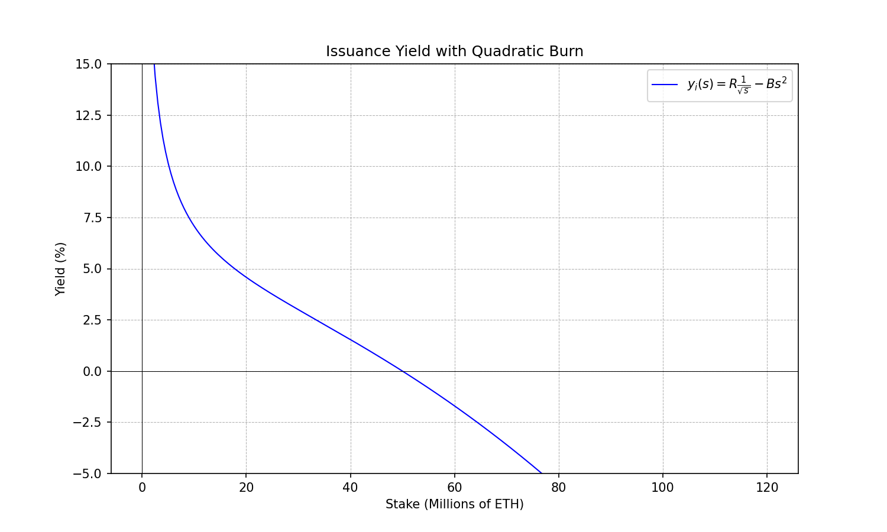
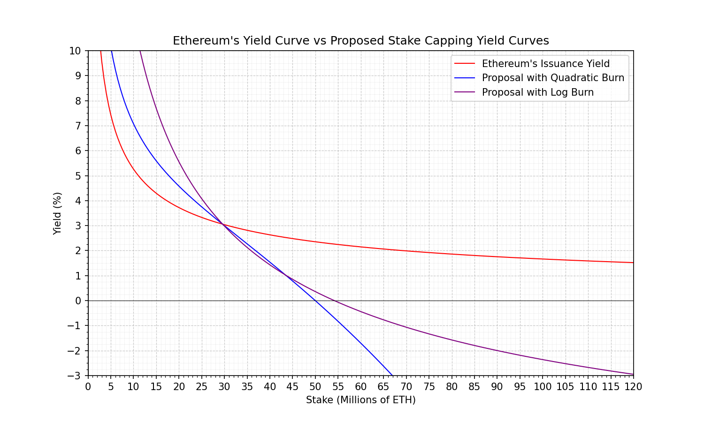
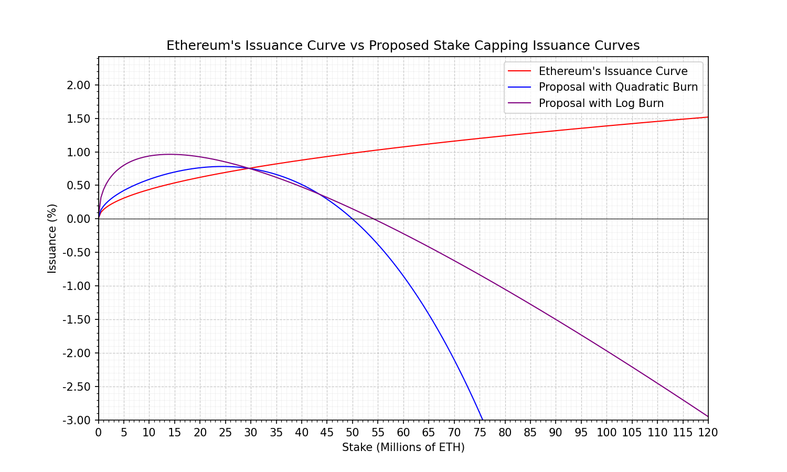
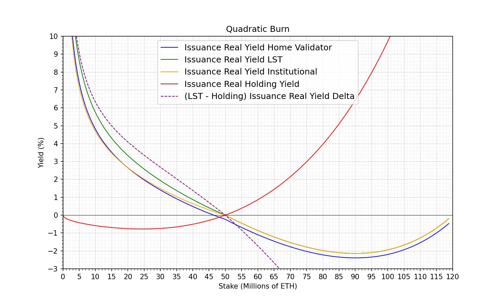
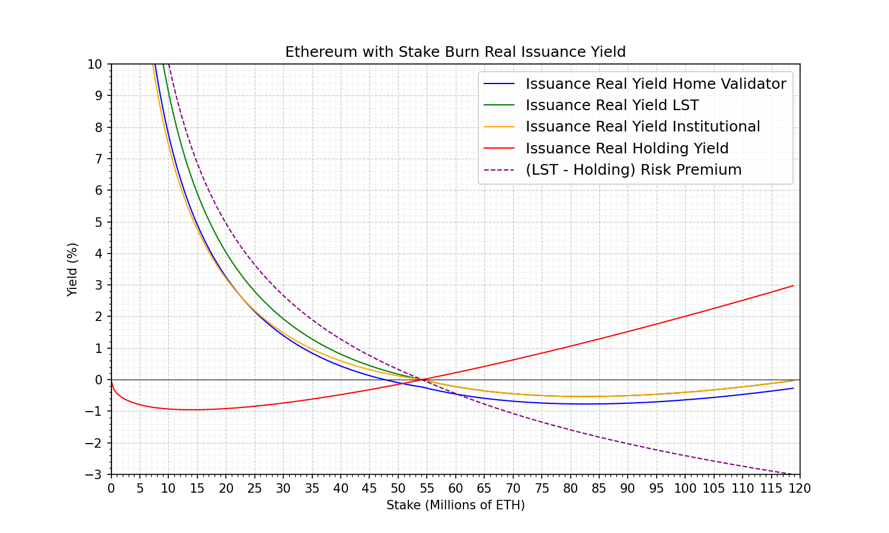
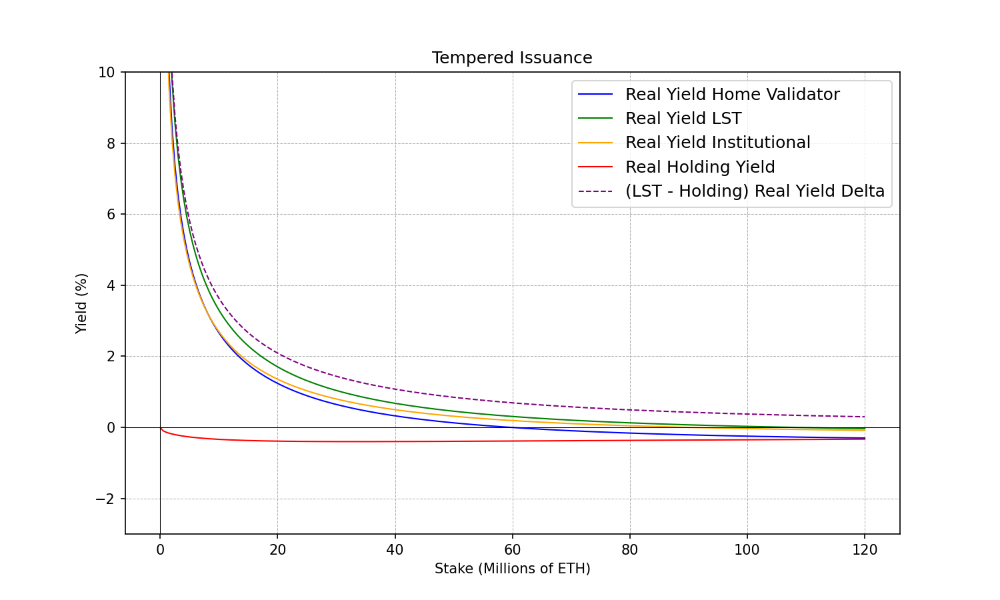

# The Shape of Issuance Curves to Come: Part 2

## Introduction

In this note we show that, under broad assumptions, we can constrain the space of issuance functions to a class that is 
well-behaved, free of pathological regimes that could produce runaway growth in the stake rate. 
These curves implement stake capping, in the sense that the issuance yield is zero at a target stake.

We then review a pragmatic way to introduce stake capping on Ethereum that is technically simple while keeping validators
honest and fulfilling their duties.

Finally, we evaluate different curves. Some with stake capping and some without. To illustrate the effect that
stake capping has on the real yield observed by different types of stakers. 
The conclusion is perhaps counterintuitive: stake capping benefits stakers, holders, and the protocol. 
The key is to look at the real yield that a staker receives, taking into account expenses and dilution. 
Stake capping ensures that all types of stakers can obtain positive real yields, reduces issuance which prevents a 
strong dilution effect on holders, and ensures the protocol does not overpay for security.

This document is accompanied by a repository with all the code and plots. Feel free to review it and test your own issuance curves.

Source: https://github.com/pa7x1/ethereum-issuance

## Staking Risk Premium and the Issuance Curve

The yield provided by staking Ethereum is market-driven, market participants expect to receive a premium for staking ETH vs. holding
ETH that compensates for the additional risks on which they partake. These risks are varied:

- Operational risks: Keeping the ETH or LST secure, smart contract risks, slashing risks...
- Liquidity risks: Staking ETH locks it in the staking contract, which makes it less liquid. LSTs alleviate some of that
illiquidity but may be subject to de-pegs, particularly when the exit and entry queues to the staking contract are full.
- Opportunity cost risks: Market opportunities you may not be able to take or would cause you to obtain worse yield if
you are staking instead of holding ETH.

The market weights all these risks and expects a yield to compensate for them. This yield is the result of the aggregate
behavior of holders and stakers, it's the yield at which the flow of holders becoming stakers and the flow of stakers
becoming holders balances out. Such that an equilibrium between both populations occurs. Borrowing terminology from A. Elowsson,
it's the _reservation yield of the marginal staker_.

Many of these risks will tend to decrease as time goes on, and this means that the risk premium will progressively get smaller and smaller.
To illustrate this, we will mention some ways in which the risks associated with staking have progressively gone down with time.

- Lindy effect: The probability of finding a new vulnerability on an existing smart contract keeps reducing
as its longevity increases. 
- Account security: Improved wallet UX, improved operational practices, advances in account abstraction, etc. make staking ETH less risky.
- Slashing protection: Slashing requires a very specific type of equivocation from the validator that can be entirely avoided with proper configuration
and awareness from the operator on which practices to avoid. Furthermore, slashing penalties have been reduced and clients offer some protections like [doppelganger protection](https://lighthouse-book.sigmaprime.io/validator_doppelganger.html). 
- Liquidity: LSTs mitigate to a large degree the liquidity risks of staking, even in situations where the entry and exit queues to the staking contract
are full, they have managed to maintain a reasonably good peg to their NAV. 
- Client diversity: Healthier client diversity has mitigated the risks of a single client bug resulting in large correlation penalties.
- Delta neutral strategies: Strategies that offer the yield of staking while hedging exposure with a short position on ETH
remove the risk of ETH price volatility while extracting the yield.
- Regulatory clarity: Completely external factors to the protocol like clear tax guidelines, regulatory clarity, 
staking ETFs, custodial services by financial institutions, etc... can significantly reduce the risk premium of staking.

Overall, as the Ethereum network matures and the risks associated with staking are reduced, the risk premium demanded by market 
participants may continue to decrease.

The role of the issuance curve becomes clearer when the yield is seen for what it is, an independent variable set by the market.
The issuance curve does not control the yield stakers observe, which is set by the market. Its purpose is to match the yield demanded by the market,
given the risk premium, with a target stake rate. Such that the stake rate is not too low, which could lower economic security. 
And not too high, which could cause the protocol to overpay for security and push stakers to observe negative real yields at high stake rates.

### A General Argument for Stake Capping

It's impossible to know beforehand what will be the risk premium that the market will demand for staking. In particular,
as the risks of holding an LST keep reducing, this risk premium could get arbitrarily small. Therefore, the yield curve should 
be able to match a stake rate for any risk premium, however small it may be.

To make the case clearer, let's focus on the real yield curves (post dilution and costs) observed by different stakers 
from Ethereum's issuance, as currently implemented.



The dashed purple line represents the difference between the issuance real yield of holding an LST (green) vs. holding ETH (red).
This is the risk premium the market demands for an LST. If the risk premium of an LST were to drop below 1.5%, we could face ever-growing
stake rates. In this regime the issuance curve fails to match the risk premium with a target stake rate. We see 
this clearly if we flip the axis and treat the yield as the independent variable, which is what the market does.



The yield curve fails to match any stake rate when the risk premium gets low enough, roughly below 1.5%, 
which would cause runaway stake rates. If this were to happen, 
every staker would observe negative real yields, staking would become a cost for everyone.
Staking may be a losing proposition, but the holding yield becomes even worse which 
pushes ETH holders to convert to LST holders in the hopes of preventing further dilution. The end result of this regime
is bad for everyone; bad for stakers, bad for ETH holders, and bad for the decentralization of the network (as argued in the
previous post).

#### Formal Definition

We will denote the yield demanded by the market from staking as $y_s$ (yield of staking). The yield of staking ETH has two components, 
the issuance yield which is controlled by the protocol, $y_i$. And the exogenous yield, $y_e$, that results from all the economic activity 
built on top of the protocol and that provides a return to stakers (e.g., tips, MEV, restaking...).

Therefore, $y_s = y_i + y_e$.

**Assumption**: The yield associated with the risk premium of staking ETH, $y_s$, is an independent variable set by the market that
can get arbitrarily close to 0. $y_s \in [0, \infty)$.

**Assumption**: The exogenous yield may provide an additional, out of protocol, source of yield to stakers. Unless the
exogenous yield can be assumed to be capped, we assume $y_e \in [0, \infty)$.

As a consequence of these two general assumptions; the issuance yield must be defined in the range $y_i \in (-\infty, \infty)$
so that for any risk premium, $y_s \in [0, \infty)$, and any exogenous yield, $y_e \in [0, \infty)$, the issuance curve 
can match the risk premium demanded by the market with a stake rate.

The inverse of the issuance yield curve $y_i^{-1}$ must be a continuous invertible function that maps the 
issuance yield set by the market ($y_i = y_s - y_e$) to a stake rate in the interval $(0, 1)$. 
That is, $y_i^{-1}: \mathbb{R} \to (0, 1)$ is a homeomorphism.

We impose continuity such that small changes in the risk premium do not cause abrupt changes in the stake rate at which
this yield is met. That the function is invertible is necessary because its inverse is the yield curve that the 
protocol implements. In turn, the continuous and invertible conditions imply strict monotonicity. We can further constrain this monotonicity to
strictly decreasing monotonicity by noting that the issuance yield must go up when the stake rate goes to 0 
to ensure there is an economic incentive to attract stakers. The functions that satisfy these conditions are decreasing 
_sigmoid_-like curves.



The yield curve ($y_i$) is the inverse of such a function. It's, therefore, a strictly decreasing function that maps the 
interval $(0, 1)$ to the real line. Like shown in the following figure:



As a direct application of the intermediate value theorem, there must be
a value for which the yield curve crosses 0. That is, the issuance curve implements stake capping.

Note that this result is quite general and it's based on quite reasonable assumptions: 
- The yield curve is able to match a stake rate for any risk premium the market may demand.
- Continuity of the yield curve.
- Invertibility of the yield curve.
- High yields at low stake rates. 

If that's the case, then the yield curve has to be a homeomorphism from $(0,1)$ to the full range of risk premia. This 
reduces the space of valid functions to sigmoid-like curves as depicted above.

#### Why are Negative Issuance Yields Needed?

To emphasize, the range of negative issuance yields is a direct consequence of the possible existence of exogenous yield.
If all sources of exogenous yield could be eliminated, then the issuance curve would inherit the same positive domain of
definition of the risk premium, $y_i \in [0, \infty)$. If exogenous yields can be assumed to be smaller than a certain bound, then
the issuance yield curve only needs to be negative up to that bound, $y_i \in [-y_e^{max}, \infty)$. But as long as exogenous yield exists, 
then the issuance curve must go negative to ensure the risk premium curve is well-defined and can always match a target 
stake rate for the given risk premium demanded by the market.

## How to Introduce Stake Capping on Ethereum

The analysis so far has been rather abstract and describes how, under general assumptions, the issuance curve needs
to adopt a specific form that implements stake capping. That is, provides 0 issuance yield at a certain target stake rate.  
And, in the presence of exogenous yield, must contain a regime of negative issuance yields 
to avoid certain pathological regimes that cause unbounded stake rate growth.

In this section we will go a step further and make a concrete proposal on how to implement a minimal change to the Ethereum
protocol to fix Ethereum's issuance curve and ensure it can match a healthy stake rate for any risk premium.

### Validator Duties and Economic Rewards

Ethereum's issuance fulfills a critical role in setting the economic incentives for a validator to perform its duties. A
validator gets paid through issuance for [attestations, sync committees, and block proposals](https://eth2book.info/capella/part2/incentives/rewards/).

If the rewards come from issuance and the issuance curve goes to 0 or even negative, does this mean that a validator
will be paid negative for meetings its duties? If that were the case, validators may start gaming the network to avoid
the cost associated with their duties, which would be very problematic.

Fortunately, this does not need to be the case! The trick is to leave the rewards associated with those duties as a positive
source of income for a validator and introduce a new negative term charged per epoch that scales with the stake.

Concretely, the issuance curve needs to have 2 components in this approach. The issuance reward, $i_r$, is a positive term, 
and the issuance burn, $i_b$, implements the negative term:

$i(s) = R i_r(s) -  B i_b(s)$

By tweaking the analytic form of the 2 terms we can ensure that $i_b(s)$ overpowers $i_r(s)$ at a sufficiently high stake,
effectively implementing stake capping.

> NOTE: Today (Pectra hard-fork), the consensus layer does not know the circulating supply of Ethereum, and therefore the issuance curve
must be defined in terms of total amount of ETH staked, as shown in the equation above.
>
> In this form, stake capping targets a maximum amount of ETH staked, but cannot truly target a percentage of the
> circulating supply of ETH staked. 
> If we were to implement the necessary technical changes to provide the circulating supply to the consensus layer, 
> we could implement proper stake rate capping. This approach would be preferred and provides for a more elegant design, 
> that is resilient under circulating supply changes. A minimal tweak to the issuance curve formula proposed above 
> to rely on the ratio between the amount of ETH staked vs. circulating supply would suffice.
> 
> The discussion on this note and the conclusions that derive from it are equally applicable.

By tweaking the ratio between the pre-factors of each term we can set the stake cap wherever we may need it. And by applying
a global factor to both we can set the desired yield at a particular stake rate. The following curve has been tweaked
to have the following properties:

- The reward term has the same analytic form as today, $i_r(s) \sim \sqrt{s}$.
- The burn has a quadratic form, $i_b(s) \sim s^2$.
- Stake Capping at 50M ETH, slightly before 50% stake rate.
- Yield at 25% stake rate fixed at 3%. Same as today's current curve at 25 %.



### Healthy Stake Ranges

We have seen how we have full freedom to decide where should the stake cap be set. In this section we will provide a number of
arguments that justify why the stake capping should be set before 50% stake rate. We will address this from different perspectives;
the protocol point of view, the staker, and the holder. We will see that it is in the interest of all of them to keep
stake rates under 50%.

**Protocol**

From the point of view of the protocol stake rates above 50% start to become problematic. Above these levels, the majority 
of circulating supply is staking. In case of supermajority bug the majority of ETH holders could be incentivized to break
the consensus rules. Stake capping and the negative yield regime can be seen as a protection mechanism from the protocol to prevent 
this type of situations from happening. It sets an economic incentive to align the social layer with the protocol interests. 

**Staker**

From the point of view of a staker, stake rates above 50% start to be self-dilutive and get stakers progressively close 
to the point where they will observe negative real yields.

To make the case clear, let's focus on the two extremes; very low stake rates, and very high stake rates.

At very low stake rates, the dilution effect of issuance is paid in full by holders which are the majority of the network.
At the other extreme, at stake rates close to 100%, the issuance income is completely coming from self-dilution. At those
levels staking yield is not real income, it's a redenomination of the unit of account. Which, when accounting for expenses
and taxes, pushes validators to observe negative real yields. Very high stake rates are bad for validators from a purely
economic perspective.

The point at which the transition between these 2 extremes happens is exactly at 50%. At stake rates beyond that point
most of the issuance income is self-dilution. Hence, the self-interest of a staker is to introduce stake capping before
50% stake rate to ensure staking ETH is guaranteed to provide a positive real yield, however low the risk premium may be.

**Holder**

For an ETH holder, very high stake rates also go against their self-interest because they cause greater dilution for holders.


### Fixing the Curve Parameters

The prefactors $R, B$ provide us two degrees of freedom with which we can set the stake cap,
and a target yield at a specific stake rate. This means we have full freedom to set the issuance yield we want
at some target stake. Introducing the negative term does not need to imply a reduction in
the issuance yield at the target stake rate.


In practice, healthy stake rates are found in a range. Too close to 50% stake
rate is bad, but too close to 0% is also bad. A pragmatic middle point is 25%, which happens to be not
too far off current stake rates (~30% circa Q4 2025).

Ethereum's issuance curve today provides a 3% issuance yield when 25% of ETH is staked. We could introduce a 
curve that maintains the same 3% issuance yield at 25% stake rate but implements stake capping.  Doing so would solve once and for
all the threat of ever-growing stake rates, but without disrupting the existing validator base.

The following figure illustrates how the curves can be introduced preserving the 3% yield at 30M ETH staked, while
introducing stake capping before 60M ETH.




The yield curves shown above are defined as follows:

```python
import numpy as np

def ethereum(staked: float) -> float:
    """
    Ethereum's current PoS issuance yield curve.
    :param staked: Amount of ETH staked.
    :return: The annualized nominal yield coming from issuance.
    """
    return 1. + 2.6 * 64 * staked ** -0.5

def quadratic_burn(staked: float) -> float:
    """
    A proposal for Ethereum's issuance yield curve with quadratic stake burn.
    :param staked: Amount of ETH staked.
    :return: The annualized nominal yield.
    """
    return 1. + 227.85 * staked ** -0.5 - 1.29e-17 * staked ** 2.


def log_burn(staked: float) -> float:
    """
    A proposal for Ethereum's issuance yield curve with log burn.
    :param staked: Amount of ETH staked.
    :return: The annualized nominal yield.
    """
    return 1. + 3.5 * (2.6 * 64 * (staked ** -0.5) - 2.6 * np.log(1. + staked) / 2048.)
```

The respective issuance curves are shown next, notice that stake capping also caps the issuance. For instance, the quadratic
burn curve would cap the maximum issuance at 0.8% annual inflation at 25M ETH staked. At 35M ETH staked the inflation rate
would be slightly below 0.7%, a minor reduction with respect to today's 0.8%. But increases in the stake rate would be met
with a significant reduction in the inflation rate.



## Real Yields

An in-depth review of the concept of real yield and how it's calculated is provided in [https://ethresear.ch/t/the-shape-of-issuance-curves-to-come/20405](https://ethresear.ch/t/the-shape-of-issuance-curves-to-come/20405).

The TL;DR is very simple, by real yield we mean the yield after costs and net of dilution effects due to supply changes.
If this number is negative it means that after expenses your income from staking is lower than the inflation rate of the network,
so you are not even earning enough ETH to compensate for the supply increase.

We will now carefully review the real yields of different curves to emphasize the
negative externalities of yield curves that do not implement stake capping and illustrate how introducing stake capping solves them.

> Disclaimer: The real yield of different stakers presented below should be seen as representative probes of the real yield
observed by that type of staker, given their typical cost structure. But mileage may vary, your specific real yield could be different depending on your
cost structure. You can review the assumptions or tweak them to fit your circumstances here: [cost_structure.py](./cost_structure.py)

### Ethereum's Issuance Real Yields

The following plot presents the real yield curves of three different types of stakers, based on their typical cost structures.
Together with the real yield of an ETH holder and the difference between the real yields of an LST and holding ETH, which
measures the risk premium of staking ETH via an LST.


**Observations:**

- The yield difference of staking with an LST vs. holding never goes below ~1.5%. If the risk premium of staking ETH were drop
below 1.5% we could face very high stake rates.
- At around 80M ETH staked, the real yield of solo staking goes negative.
- At around 110M ETH staked, the real yield of staking with an LST goes negative. At which point every staker receives
negative real yield, and so do holders. Where is the money going? HW vendors, ISPs, and taxes, primarily.
- The large gap between solo stakers and LSTs receiving negative real yields creates
a regime where solo stakers are pushed out of the validator set but LSTs can still be viable. Resulting in a centralization
threat to the network.

### Quadratic Burn Proposal Real Yields



**Observations:**

- This issuance curve implements stake capping. At 50M ETH staked, the issuance yield goes to 0%. And beyond that it turns
negative. Being able to compensate for large amounts of exogenous yield.
- The ranges at which all types of stakers go to negative real yields have compressed significantly and happen very close
to the stake cap.
  - Avoids a large regime where solo stakers are pushed out of the validator set.
  - It also means that staking can provide positive real yield for every staker even if the risk premium were to drop as low as 0.5%.

### Log Burn Proposal Real Yields



**Observations:**

- This issuance curve implements stake capping. At ~55M ETH staked, the issuance yield goes to 0%. And beyond that it turns
negative.
- The slope towards negative yields is gentler than the example with quadratic burn. This results in the following:
  - Less exogenous yield could be burnt, up to 3%. Exogenous yields above that could cause runaway stake rates.
  - The gentler slope means that the range at which solo stakers observe negative real yields vs. LSTs widens with respect
  to the quadratic burn. But it's significantly tighter than with no capping.


### Tempered Issuance Real Yields



- Tempered issuance does not implement stake capping. Having a minimum risk premium of around ~0.5%. Arguably quite low
but not 0%. If the risk premium of staking were to drop below that point it could face very high stake rates.
- At around ~60M ETH, solo staking observes negative real yields which could cause solo stakers to get pushed out of the 
validator set.
- While LSTs remain viable until extremely high stake rates.
- Two effects are at play that caused an increase of the gap between solo staking crossing 0% real yield and LSTs.
  - Tempered issuance has a very gentle slope of the real yield at high stake rates. Gentler slopes tend to widen the gap. For contrast, check
  the quadratic stake burn curve. An aggressive slope down causes all types of stakers to get pushed down at the same time.
  - Tempered issuance, with the default parameters, provides very low nominal yield. Low nominal yields tend to kick out
  solo stakers first, because the cost structure of solo stakers has a higher component of fixed costs. If the yield is
  small enough fixed costs will eat it away.
