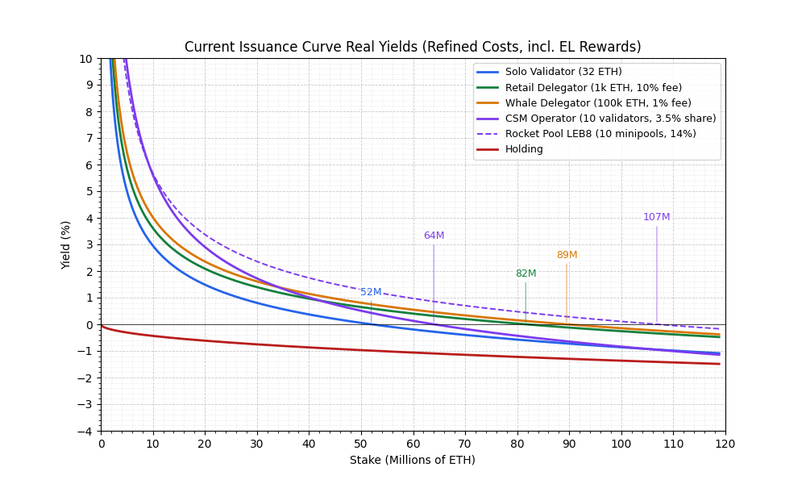
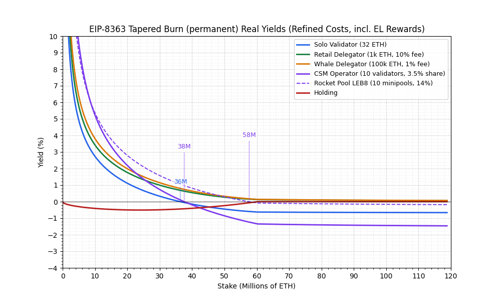
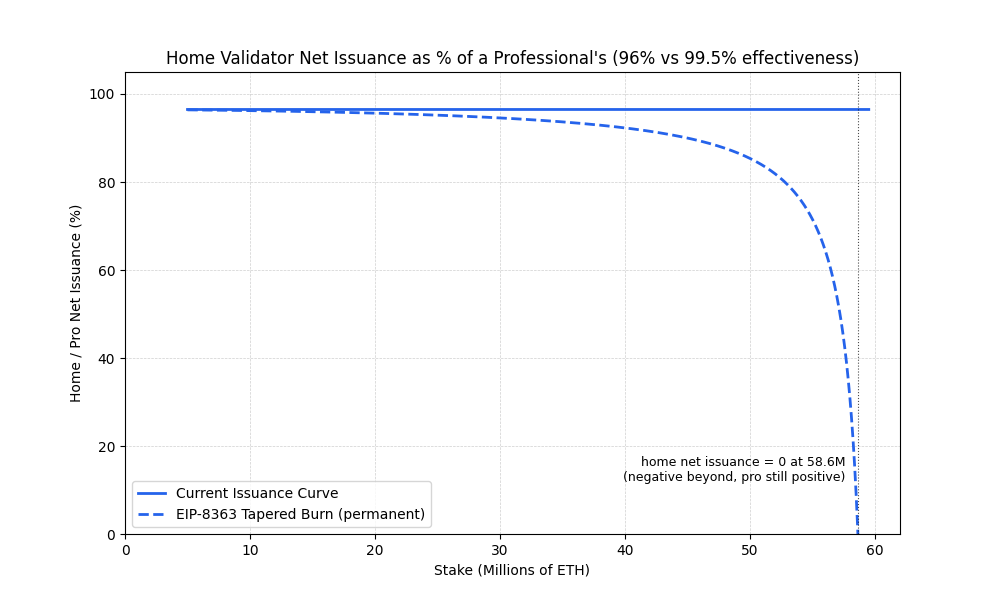
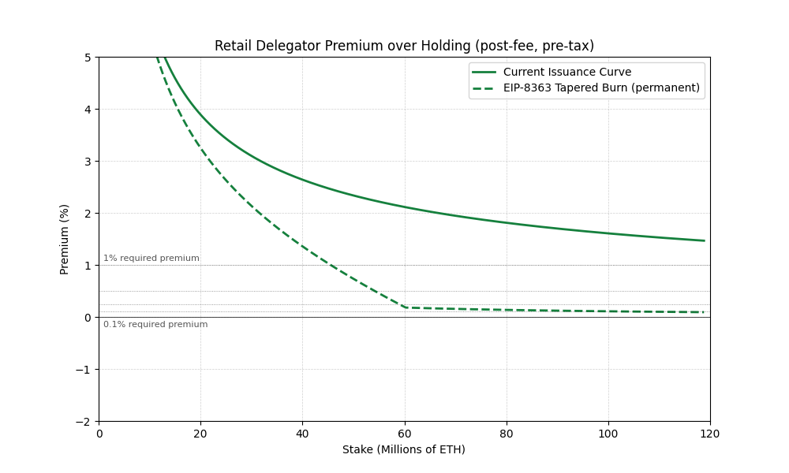
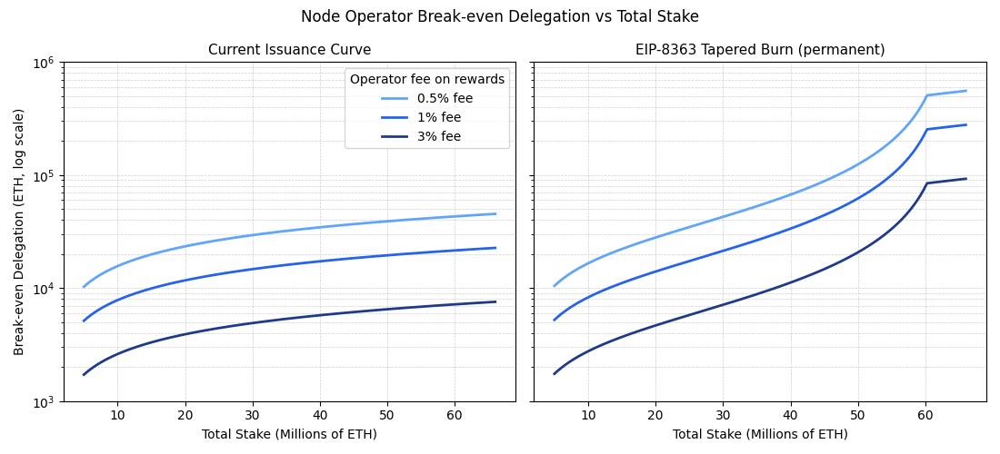
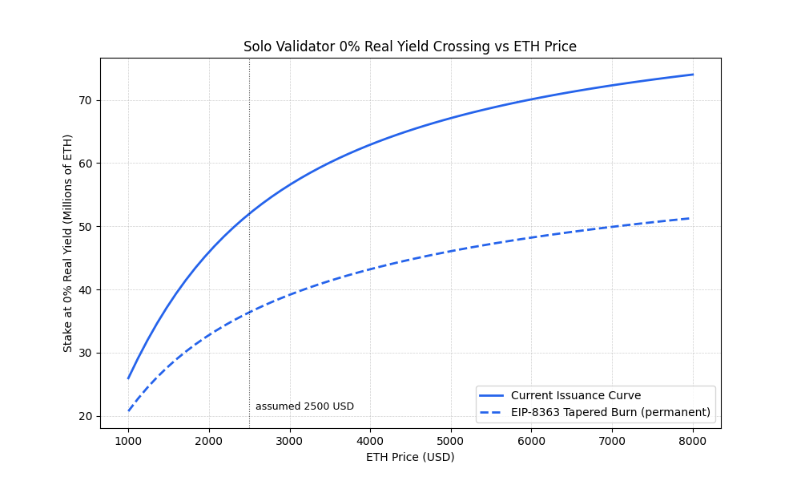

# Refined Cost Structures: Solos, Delegation, and EIP-8363

This note re-runs the real-yield analysis of [README.md](README.md) with a more detailed cost model and focuses it on the choice actually in front of the network: the **status quo curve vs the [EIP-8363 tapered issuance burn](https://github.com/ethereum/EIPs/pull/12081)**. The framing is deliberately narrow: the individual's decision is *solo staking vs delegation*; the interesting sub-questions are the economics of delegating to a large organization vs a small operator, and whether bonded small-operator systems (Lido CSM, Rocket Pool) can survive each curve — both at the operator level and at the level of the programs themselves, which their sponsors must fund.

Cost figures come from [validatorcosts.kyne.eu](https://validatorcosts.kyne.eu) (solo staking priced bottom-up: hardware depreciation, power, internet, labor) plus published CSM v2 and Rocket Pool LEB8 parameters. The base case uses roughly today's market price of **2,500 USD/ETH**, with **4,000 USD** reported as the appreciation scenario throughout — USD-fixed costs against ETH-denominated stakes make every viability figure price-sensitive. The code lives in [`cost_models.py`](cost_models.py), [`yields.py::real_staking_yield`](yields.py), [`operator_economics.py`](operator_economics.py) and [`refined_costs/analysis.py`](refined_costs/analysis.py); the original probes in `cost_structure.py` are untouched and reported alongside. Reproduce with `uv run python -m refined_costs.analysis`.

## TL;DR

1. **At today's prices, EIP-8363's permanent curve leaves solo stakers real-negative barely above today's stake level.** With costs priced honestly (labor at 20 USD/h, internet allocation, 4-year depreciation, 30% tax: ~557 USD/yr, 0.70% of a 32 ETH stake at 2,500 USD/ETH), the solo's 0% real-yield crossing is ~52M ETH staked under the current curve and **~36M under EIP-8363 — only ~2M above the ~34M staked today, a gap the [~2.2M ETH already in the activation queue](https://www.validatorqueue.com/) closes on its own**; the 18-month transition (elevated base reward factor) postpones the arrival. If ETH appreciates back to 4,000 USD the crossings move out to ~63M and ~43M; an *expectation* of appreciation similarly lets stakers tolerate temporary negative real yield, so these crossings are floors on rational exit, not triggers. The delegation pull (retail delegator real yield minus solo real yield) is **positive at every stake level under both curves** — +0.59pp today at 2,500 USD, rising to ~+0.75pp under EIP-8363 as stake grows — so self-operating 32 ETH never beats delegating it. One policy lever outweighs every curve parameter here: **created-property tax treatment** (rewards taxed at sale, not at receipt — as [advocated by the Proof of Stake Alliance](https://www.proofofstakealliance.org/key-issues/#taxation)) would, in the deferral limit, move the solo crossing from ~52M to ~80M under the current curve (~36M to ~45M under EIP-8363) and flip the delegation pull *negative* at today's stake — solos would out-earn retail delegators.

2. **EIP-8363 caps issuance, but its equilibrium floor is the MEV pie — and that floor is price-independent.** The tapered burn floors yield at zero and leaves EL rewards untouched, so a delegator's real premium over holding falls to ~0.18% at the 50% saturation point and ~0.09% at 99% staked — **never negative**, at any ETH price (premiums are ETH-denominated ratios). Where stake stops depends entirely on the premium the marginal delegator demands: 0.5% → ~54M (45%); 0.25% → ~59M (49%); 0.1% → **~108M (90%, notional — see the practical ceiling below)**. A knife's edge on a number nobody can measure or govern, and external incentives (CEX fee rebates, points) can subsidize the effective premium below the floor entirely. In practice the ratio cannot run to the extreme rows: not all ETH can stake (lost coins, deep cold storage, DeFi collateral, custodians that don't offer staking), and no PoS chain surveyed exceeds ~72% staked even with zero slashing and stronger dilution push — so ~two-thirds of supply is a generous practical ceiling, and the knife-edge matters in the 45–80M range.

3. **Cross-chain evidence says low premia are reachable, and slashing is Ethereum's main brake.** Sui sustains ~72% staked with staker APR at or *below* inflation — a zero-to-negative real premium — because staking there is liquid, frictionless, and unslashed; Solana (~69%) has no activated slashing; chains that slashed delegators are retreating (Polkadot made nominators unslashable in 2026). Ethereum is the only chain surveyed where delegated principal faces automated, correlation-scaled slashing, which keeps the required premium positive and argues for an EIP-8363 equilibrium below ~60% staked (premium there ≈0.15%). But that brake erodes as custody matures; it is not a protocol constant.

4. **At any plausible EIP-8363 equilibrium, no self-operated home stake covers its costs.** At 2,500 USD/ETH every home configuration — solo (36M), CSM permissionless (38M), CSM ICS (44M) — is underwater before the *lowest* equilibrium in the table (~46M at a 1% required premium); only Rocket Pool's larger-bond model reaches ~58M. Even in the 4,000 USD scenario the solo (43M) and CSM permissionless (46M) sit at or below it. The stake that remains at equilibrium is delegated stake.

5. **Bonded small operators (CSM/Rocket Pool) are the strongest home path under the status quo — and EIP-8363 largely closes it at the operator level.** Matching a small bond against other people's deposits earns a levered commission (a transfer from delegators, not just issuance): ~5.4% gross on own capital today for a 10-validator CSM permissionless operator (3.5% share), ~7.3% for the vetted ICS tier (6%), ~4.6% for Rocket Pool LEB8 (14% on borrowed ETH). Under the proposal the burn taxes exactly the rewards the commission is levered on, so the leverage that makes bonded operation work is the first thing removed. A solo converting to CSM buys almost nothing under the proposal; converting to plain delegation buys permanence.

6. **The rails themselves may not survive: module *programs* don't self-fund under the cap.** CSM and Rocket Pool are products that core teams must build and run — development, audits, oracles, support — plausibly millions of USD per year each. Funding that from a ~4% sponsor share of module rewards requires, at 2,500 USD/ETH, ~**0.94M ETH** of module TVL under the *current* curve at today's stake — above CSM's ~770k and well above Rocket Pool's ~530k — and under EIP-8363 it rises to ~1.5M today, ~2.6M at 45M staked, and **~15M at saturation**. Appreciation to 4,000 USD makes the current curve roughly self-funding and leaves the capped curve still impossible past ~45M staked. In other words: today these rails already lean on sponsor cross-subsidy; under the proposal, the sponsor's whole revenue base shrinks with the same curve, so small-operator delegation can disappear even where individual operator economics would survive.

7. **Professional operators consolidate too.** At 2,500 USD/ETH a 1%-fee operator needs ~16k ETH delegated to break even today; EIP-8363 raises that ~60% on day one (~25k) and to ~154k near saturation. Both routes to being a small operator — bonded validators or fee-based operation — narrow sharply, while delegation itself never stops paying.

8. **The burn's idealized basis makes it regressive on validator effectiveness.** Rewards scale with a validator's own performance; the burn is sized on the idealized reward and (by design, to keep duty incentives sharp) does not. Net issuance per validator is ideal × (e − b): a 96%-effective home validator (beaconscores: Rocket Pool ~96.1%, solos <96.5%, pros >99.5%) earns 96.5% of a professional's issuance today but 87.5% at 40% staked, 35.7% at 48%, and goes **negative at ~48.9% staked while professionals still earn** — the zero floor only exists at 100% effectiveness. It moves the solo real-yield crossing only ~1M (36.4 → 35.4M) but stacks on every other disadvantage in the persistence regime near the cap. [Raised on the Magicians thread](https://ethereum-magicians.org/t/eip-8363-tapered-issuance-burn/29263/240); see [the effectiveness section](#the-idealized-burn-amplifies-effectiveness-gaps).

9. **The ratio may be the wrong security variable to optimize.** The 50% saturation point targets finality-style attacks that are niche, hard to monetize, and self-immolating. The cheaper failure mode is majority *selective attestation* — censorship — and against it the defense is concentration, not ratio: the Nakamoto coefficient and the Gini of stake per operating entity. An operator securing 1M ETH (~2.5B USD) at a 1% fee earns ~2,200 USD/day today and ~350 USD/day under the cap — trivially dominated by side payment or legal coercion. Since the proposal prices out precisely the small operators and routes marginal stake to the largest delegates, it can bound the ratio while worsening Nakamoto and Gini — optimizing the metric that matters least of the three (**Nakamoto > Gini > Ratio**). See [Ratio, Nakamoto, Gini](#ratio-nakamoto-gini-what-is-the-cap-protecting).

None of this is an argument for the status quo, which has no cap at all and already churns solos at ~52M at today's prices. It is an argument that the proposal's cap should not be left leaning on an eroding risk premium and an unpriced MEV pie — and that the security variable being optimized deserves scrutiny. Pairing EIP-8363 with created-property tax treatment (the single biggest lever for solo viability), an eventual negative-issuance regime or in-protocol MEV handling to harden the cap, and uncorrelation incentives that directly target the Nakamoto coefficient would address every gap identified in this note.

## What changed in the assumptions

| Assumption | Original (`cost_structure.py`) | Refined (`cost_models.py`) | Why |
| --- | --- | --- | --- |
| ETH price | 4,000 USD | **2,500 USD base** (~today's market), 4,000 USD appreciation scenario | USD-fixed costs vs ETH stakes make viability price-sensitive; both reported |
| Hardware depreciation | 1,000 USD over 5 years | 1,000 USD over 4 years | validatorcosts.kyne.eu default; 5-year variant reported below |
| Electricity | 100 USD/yr | 47 USD/yr (30 W × 0.18 USD/kWh) | metered bottom-up |
| Internet | 0 (paid by personal use) | 120 USD/yr allocation | staking degrades a shared home connection — a commonly reported churn reason; zeroing it hides a real cost |
| Labor | 0 (hobbyist) | 0.5 h/month + 4 h setup at 20 USD/h ≈ 140 USD/yr | maintenance is real work; valuing it at 0 hides a structural advantage of delegation |
| **Solo fixed total** | **300 USD/yr (0.23% of stake)** | **557 USD/yr (0.70% of stake at 2.5k, 0.44% at 4k)** | at 32 ETH |
| Tax on staking income | 20% (OECD avg marginal on labor) | 30% | western ordinary/capital-income treatment is typically 25–30%+; rebasing-LST deferral treated as a sensitivity |
| Cohorts | Home / LST / enterprise self-staker | **Solo (32 ETH)**; **retail delegator** (1k ETH, ~10% fee); **whale delegator** (100k ETH, ~1% negotiated fee); **bonded small operators** (CSM permissionless 3.5% share and ICS 6%, Rocket Pool LEB8 14%); **professional node operator** as a fee business; industrial self-staker kept as a minor cohort | the individual's real choice is solo vs delegation; the delegation-side question is large org vs small operator, and whether small-operator rails survive. The 0.5–3% an operator receives vs the 1–10% a delegator pays is the custodian/LST spread (not modeled yet) |
| Module programs | — | Sponsor program overhead ~3M USD/yr funded by a ~4% share of module gross rewards; reference sizes CSM ~770k ETH, Rocket Pool ~530k ETH | the rail exists only if someone can afford to run the program, not just the validators |
| MEV / priority fees | Not modeled | Fixed ~120k ETH/yr pie (≈0.35% APR at 34M staked); solos realize 0.5× the mean (heavy-tailed proposer rewards), pools smooth to 1.0× | the EL pie is set by blockspace demand, not issuance policy — as issuance falls it automatically dominates rewards |
| Curves | Current + repo candidates | **Current vs EIP-8363** (permanent state): net yield = current × (1 − (staked/60.25M)^{3/2}), floored at 0; issuance peaks at ~19.8% staked (~0.5% of supply, ~2.5% nominal at 20%) and is cancelled at 50% | 8363 is the concrete proposal on the table; the repo's other candidates are kept in `curve_picker/` but not analyzed here to avoid multiplying proposals |

Two modeling corrections come with this: **fees and taxes are applied in order** (fee on gross rewards, tax on post-fee rewards), and **EL rewards are excluded from the dilution denominator** — priority fees and MEV are recycled ETH, not new supply.

## Results

Stake level at which each cohort's real yield crosses 0% (stops beating holding), at the 2,500 USD base and in the 4,000 USD appreciation scenario:

| Cohort | Current @2.5k | Current @4k | EIP-8363 @2.5k | EIP-8363 @4k |
| --- | --- | --- | --- | --- |
| Solo validator, original probes | ~81M | ~81M | ~50M | ~50M |
| **Solo validator, refined** | **~52M** | **~63M** | **~36M** | **~43M** |
| Retail delegator (10% fee) | ~82M | ~82M | **never** | **never** |
| Whale delegator (1% fee) | ~89.5M | ~89.5M | **never** | **never** |
| Industrial self-staker (100k ETH own) | ~101M | ~101M | **never** | **never** |
| CSM permissionless (1 validator) | underwater today | underwater today | underwater today | underwater today |
| CSM permissionless (10 validators, 3.5%) | ~64M | ~87M | **~38M** | ~46M |
| CSM ICS (10 validators, 6%) | ~94M | never | ~44M | ~51M |
| Rocket Pool LEB8 (10 minipools, 14%) | ~107M | ~114M | ~58M | ~68M |

(The original probes are price-insensitive only because they were quoted directly as a ratio at 4,000 USD; delegator crossings barely move because their costs are fees, not USD.)

### Current curve

The solo's shift from the original ~81M to ~52M at today's price decomposes as: tax 20%→30%, bottom-up fixed costs, a lower ETH price, partially offset by median MEV capture. MEV helps pooled stakers about twice as much as solos.

Bonded operation is the standout home path: commission income is levered on other people's deposits while dilution applies only to own capital, so the 10-validator CSM operator and the Rocket Pool operator outlast every self-operated configuration and most delegators. Two qualifiers: a **single-validator CSM operator is underwater today** (~4.4% gross vs a 9.3% fixed-cost ratio on a 2.4 ETH bond at 2,500 USD — bonded home operation only pencils across several validators per rig or at hobbyist-priced labor), and the headline tiers are favored niches: the 6% ICS share applies to vetted identities on the first 16 keys; the default permissionless share is 3.5%.

### EIP-8363

The proposal's net yield is the current curve times $(1 - (s/60.25\text{M})^{3/2})$, floored at zero — a **baguette-type curve** in this repo's taxonomy, and [curve_picker/Analysis.md](curve_picker/Analysis.md) already identified the failure mode of that class: with no negative-issuance regime the curve cannot charge exogenous yield. With EL rewards modeled explicitly, that abstract concern becomes the central fact:

- At 2,500 USD/ETH the solo crosses at ~36M — **only ~2M above today's stake level, which the [current activation queue](https://www.validatorqueue.com/) (~2.2M ETH) covers by itself** — and **CSM permissionless crosses right beside them (~38M)**: the burn taxes exactly the validator rewards the commission is levered on, so the leverage that makes bonded operation work is the first thing the proposal removes. ICS reaches ~44M, Rocket Pool ~58M (pre-RPL drag). Appreciation to 4,000 USD moves each out (~43M / ~46M / ~51M / ~68M) but preserves the ordering and the conclusion.
- Delegators (retail, whale) and the industrial self-staker **never** cross: past saturation their real yield is the fee-adjusted MEV pie, always positive, always above holding.
- The delegation pull grows with stake under the proposal (+0.68pp today → +0.75pp at 60M, at 2,500 USD) because it shrinks the issuance component — on which the solo's cost disadvantage is proportionally larger — while leaving the pools' fee-free MEV advantage intact.

### The idealized burn amplifies effectiveness gaps

A subtler mechanism, [raised on the Magicians thread](https://ethereum-magicians.org/t/eip-8363-tapered-issuance-burn/29263/240), compounds all of the above. Per the spec, a validator's rewards scale with its own performance, but the burn is sized on the **idealized** reward for each assigned duty — deliberately, so that skipping duties never reduces the burn and the incentive to perform stays sharp. The side effect: per-validator net issuance is $\text{ideal} \times (e - b)$, where $e$ is the validator's effectiveness and $b$ the burn fraction. Home-run validators sit measurably below professionals on this axis (beaconcha.in entity beaconscores: Rocket Pool ~96.1%, solo stakers below ~96.5%, large professional operators above 99.5%).

Today an effectiveness gap is a proportional penalty: a 96%-effective home validator earns 96.5% of a 99.5%-effective professional's issuance, at any stake level. Under EIP-8363 the same gap is amplified without bound as $b$ approaches $e$: 93.9% of the pro's issuance at today's ratio, 91.4% at 35% staked, 87.5% at 40%, 75.2% at 45%, **35.7% at 48%** — and at 48.9% staked (~58.6M) the home validator's net issuance hits zero and goes **negative** while the professional still earns. (The thread's stronger assumption of ~94% home effectiveness gives 87%/81%/62% at 35/40/45% — our figures are the conservative end.) Two consequences:

- **The zero floor only exists at 100% effectiveness.** For every real validator the curve is not a baguette: net issuance goes negative before saturation, weakest operators first — an ordering exactly backwards from the uniform burn this repo's candidates apply.
- The effect on the real-yield crossings themselves is modest (solo: 52.0 → 51.0M current curve, 36.4 → 35.4M EIP-8363, at 96% effectiveness), because the crossings sit at low burn fractions — but in the persistence regime between 40% and the cap it stacks on top of the fixed-cost and MEV disadvantages, and it equally degrades CSM and Rocket Pool operators, whose commissions are levered on home-run validators' actual rewards.

The design faces a genuine dilemma here: sizing the burn on *actual* rewards would restore the floor but make skipping duties reduce the burn, blunting the incentive to perform at high burn fractions. As specified, the EIP resolves it in favor of duty incentives at the cost of a regressive distributional effect — worth weighing explicitly, since it selects against precisely the operators the uncorrelation arguments want to keep.

## Equilibrium: where does stake growth stop?

The marginal delegator stakes while their real premium over holding (post-fee, pre-tax) exceeds the premium they require for liquidity, slashing, and smart-contract risk. These premiums are ETH-denominated ratios, so this table is independent of the ETH price:

| Required premium | Current curve | EIP-8363 |
| --- | --- | --- |
| 1% | never reached | ~46M (38%) |
| 0.5% | never | ~54M (45%) |
| 0.25% | never | ~59M (49%) |
| 0.1% | never | **~108M (90%)** |
| 0% | never | **never** |

EIP-8363's premium asymptotes onto the MEV floor: **0.18% at saturation, 0.09% at 99% staked, never negative.** Between required premia of 0.25% and 0.1% the equilibrium swings from 49% to 90% of supply — a knife's edge on a quantity nobody can measure, and one that external incentives (a CEX rebating trading fees against delegated ETH, points programs) can push below the floor entirely. The cap is soft by exactly the size of the EL pie, which the protocol does not control.

**Both curves also face a non-economic ceiling.** Not all ETH can stake: some is lost outright, some sits in deep cold storage or with custodians that do not offer staking, a large share is deployed as DeFi collateral and gas float, and for a risk-conscious holder ~1.5%/yr of dilution does not compensate the slashing tail risk on an asset with ~40% annualized volatility. Even the most staking-friendly chains in the table below top out at ~72% with none of those frictions and fewer competing uses for the asset, so Ethereum's ceiling plausibly sits below two-thirds. Read the "never" rows through that lens: they mean the premium never binds and the equilibrium becomes supply- and friction-bound instead. The distinction matters for framing, not for the conclusion — a friction-bound equilibrium near the ceiling still sits far above the 50% level that both this repo and the EIP treat as unhealthy, with everyone diluted along the way under the current curve.

To be fair to the proposal, it is roughly a **10× improvement on the status quo**: the current curve's premium floor is ~1.5%, so below that the premium never binds at all and the ratio is limited only by the frictions above — [README2.md](README2.md)'s runaway-ratio concern in its practical form. EIP-8363 narrows the premium-unbound regime from "premium below 1.5%" to "premium below ~0.1–0.2%". The residual softness is the MEV pie, which no issuance curve controls; closing it requires either a negative-issuance regime of the kind this repo's candidates explore (which crosses *any* premium, including zero, by construction — see [curve_picker/Analysis.md](curve_picker/Analysis.md)) or in-protocol MEV capture.

**Reachability is not hypothetical.** Cross-chain data (~Aug 2026, [stakingrewards.com](https://www.stakingrewards.com) and chain docs; approximate):

| Chain | Staked | Inflation (non-staker dilution) | Staker APR | Slashing of principal |
| --- | --- | --- | --- | --- |
| Sui | ~72% | ~2.5%/yr | ~1.4–2.5% | none (rewards only) |
| Solana | ~69% | ~3.8%/yr → 1.5% terminal | ~5–7% | none activated |
| Cosmos Hub | ~65% | ~10–13%/yr | ~15–19% | 5% double-sign; delegators exposed |
| Cardano | ~58% | ~1.5–2%/yr (fixed reserves) | ~2–3% | none at all |
| Tezos | ~55–60% | ~3.8%/yr (adaptive) | ~7% | ~5–10%; plain delegators exempt |
| Polkadot | ~52% | ~1.5–3%/yr (post-2026 halving) | ~3–6% | nominators made **unslashable** in 2026 |
| Tron | ~47% | ~0.4%/yr | ~3–5% | none |
| Avalanche | ~45% | ~3.3%/yr | ~6.7–8% | none |
| **Ethereum** | **~29%** | **~0.35–0.8%/yr** | **~3%** | **automated, correlation-scaled, delegators exposed** |

High ratios elsewhere are reached by dilution-push plus zero slashing risk; Sui's 72% at a zero-to-negative real premium shows required premia can collapse entirely when staking is liquid and riskless. Ethereum's severe, delegator-exposed slashing is what keeps its required premium positive — supporting an EIP-8363 equilibrium below ~60% staked (premium there ≈0.15%) — but the industry direction is uniformly towards removing delegator risk, and Ethereum's own custody layer (ETFs, insured custodians, socialized-slashing LSTs) erodes it too. **A cap that depends on a risk premium erodes with it.** And at every equilibrium in the table above (≥46M), the solos and CSM operators are already underwater at today's prices: the stake that remains is delegated.

## Can the small-operator rails afford to exist?

Operator-level viability is necessary but not sufficient: CSM and Rocket Pool are *programs* their sponsors must build and run — protocol development, audits, oracles, monitoring, support — plausibly ~3M USD/yr each for the core teams. The program's native funding is the sponsor's share of the module's gross staking rewards (~4% as a probe: Lido's treasury part of the 10% fee after the operator share; Rocket Pool funds development via RPL, but the economic requirement is equivalent). Module TVL required for that share to cover the program:

| Total staked | Curve | Required module TVL @2.5k | @4k |
| --- | --- | --- | --- |
| 34M (today) | Current | **0.94M ETH** | 0.58M |
| 34M | EIP-8363 | 1.50M | 0.94M |
| 45M | EIP-8363 | 2.62M | 1.64M |
| 55M | EIP-8363 | 5.94M | 3.71M |
| 60.25M (saturation) | EIP-8363 | **15.1M** | 9.4M |

Against actual module sizes of ~770k ETH (CSM) and ~530k ETH (Rocket Pool), the reading is stark: **at today's prices these rails run at or below self-funding on the current curve** — they lean on sponsor cross-subsidy — and under EIP-8363 the requirement runs away to ~20–28× their current size at saturation. Appreciation to 4,000 USD makes the current curve roughly self-funding (CSM clears, Rocket Pool is marginal) but leaves the capped curve impossible past ~45M staked. And the cross-subsidy itself is not safe: the sponsor's whole revenue base (fees on all delegated TVL) shrinks under the same curve. So under the proposal, small-operator delegation can disappear even where individual operator economics would survive — the rail's existence, not just its operators' margins, is what the curve threatens.

## Node operator economics

Break-even delegation for a professional operator with ~12.6k USD/yr of fixed costs (5 servers at 200 USD/mo + labor), at 2,500 USD/ETH:

| Total staked | Curve | 0.5% fee | 1% fee | 3% fee |
| --- | --- | --- | --- | --- |
| 34M (today) | Current | 31.5k | 15.8k | 5.3k |
| 34M | EIP-8363 | 50.6k | 25.3k | 8.4k |
| 45M | EIP-8363 | 88.2k | 44.1k | 14.7k |
| 55M | EIP-8363 | 200.3k | 100.1k | 33.4k |
| 58M | EIP-8363 | 308.2k | 154.1k | 51.4k |

(Appreciation to 4,000 USD cuts each figure by ~40%.) Fee revenue tapers with rewards, so the proposal raises today's break-evens ~60% immediately and ~10× near saturation: sub-1% fees only pencil for six-figure ETH books. Together with the bonded-operator and program-viability results, every route by which a small operator can exist narrows sharply under the proposal, while delegation itself never stops paying.

## Ratio, Nakamoto, Gini: what is the cap protecting?

Everything above accepts the framing that the staking *ratio* is the security variable — the EIP's 50% saturation point, and this repo's own Heuristic 0. It is worth questioning. 50% is a focal number, not a cliff: the canonical thresholds (>33% to stall finality, >50%, >66% to finalize invalid state) describe attacks that are niche, spectacularly expensive to monetize, and self-immolating — the attacker's stake is slashed and burned at a scale comparable to anything they could extract.

The cheaper and likelier failure mode is **selective attestation**: a majority of stake-weight quietly declining to attest to blocks containing disfavored addresses or applications. That is censorship, it is not a slashable offense, and the economics of resisting it are thin. Issuance is the carrot, and the operators who wield the stake see only a sliver of it: an operator running 1M ETH — about 3% of today's stake, ~2.5B USD of other people's capital secured — earns at a 1% fee roughly **0.9 ETH (~2,200 USD) per day**. Under EIP-8363 near the cap, the same book earns ~**350 USD per day**. A side payment — or, more realistically, a legal compulsion whose cost of compliance is measured against that revenue — does not need to be large to dominate what the operator is paid. Widespread selective attestation would not revert a single block, but it redefines what the chain's security *is*: not "cannot be reverted" but "cannot be filtered."

Against that failure mode, the defense is not the ratio but **concentration**: the Nakamoto coefficient (the fewest distinct entities whose compromise or coercion reaches a majority of stake-weight) and, beneath it, the Gini of stake per withdrawal address / operating entity. Marginal stake entering at *any* ratio increases security if it improves those metrics and decreases security if it degrades them — a unit of stake flowing to a new independent home operator is a different security object than the same unit flowing to the largest custodial delegate, whatever it does to the ratio.

This analysis's own findings then cut against the proposal on exactly that axis: EIP-8363 prices out solos (~36M), CSM operators (~38M), and small fee-based operators (break-evens up ~10× near the cap), while delegation to low-cost massive operators never stops paying. Marginal stake under the cap therefore flows disproportionately to the largest, cheapest, most coercible entities — the ratio is bounded while the Nakamoto coefficient and Gini plausibly worsen. A cap that improves the metric it targets while degrading the metrics that defend against the realistic attack may lower security in the sense that matters. The priority ordering this suggests — **Nakamoto > Gini > Ratio** — implies that uncorrelation incentives and operator-viability protections are not complements to an issuance cap; they are the main event, and an issuance change that ships without them optimizes the wrong variable. (This argument is also raised on the [EIP-8363 Magicians thread](https://ethereum-magicians.org/t/eip-8363-tapered-issuance-burn/29263/185).)

## Sensitivities

- **ETH price is first-order**: the solo crossing under the current curve runs from ~46M at 2,000 USD through ~52M at the 2,500 base to ~74M at 8,000. Expectation of appreciation lets a staker tolerate temporary negative real yield (their future cost ratio shrinks), so crossings are floors on rational exit rather than triggers; symmetrically, depreciation accelerates every exit in this note.
- **Depreciation 4 → 5 years:** 557 → 503 USD/yr. Second-order.
- **Hourly rate:** every +10 USD/h adds ~75 USD/yr to the solo; the hobbyist framing is load-bearing, doubly so for small bonded operators (a 2.4 ETH bond carries a 9.3% cost ratio at 2,500 USD and 20 USD/h).
- **Tax treatment is the single biggest non-protocol lever.** The base case taxes staking rewards as income at receipt (30%), which is today's treatment in most jurisdictions (e.g. IRS Rev. Rul. 2023-14 in the US). The [Proof of Stake Alliance](https://www.proofofstakealliance.org/key-issues/#taxation) advocates treating rewards as **created property, taxed at sale rather than at creation** — the baker is taxed when the bread is sold, not baked. In the deferral limit (0% at receipt, rewards compounding untaxed) the solo crossing moves from ~52M to ~80M under the current curve and ~36M to ~45M under EIP-8363, and the delegation pull at today's stake flips from +0.59pp to **−0.31pp**: solos would out-earn retail delegators. Actual capital-gains-at-sale lands between those bounds (rates and holding periods differ from income), and rebasing LSTs already enjoy a version of this deferral — so the current asymmetry is not just costs, it is tax code, and fixing it does more for solo stakers than any issuance curve discussed here.
- **Operator and program terms are probes:** ICS is capped at 16 keys, CSM squads (4 operators) carry higher opex per operator, Rocket Pool's RPL collateral is unmodeled drag, Saturn-era parameters (4 ETH bonds from Jan 2026) will differ, and the 3M USD/yr / 4% program probe is an order-of-magnitude estimate. The qualitative results — levered viability under the status quo, operator and program viability capped under the proposal — are robust to reasonable variation; the specific crossings are not.

## Consistency notes

Found while reconciling the original numbers; none change conclusions but the README and code should agree: `README.md` prose uses c = 1/1000, 35% tax, 600 USD/yr internet while `cost_structure.py` uses c ≈ 0.23%, 20% tax, 0 internet (the README's "~70M" reproduces with the prose values, not the code's); LST scaling cost is 14% in the README vs 10% in code; institutional fixed cost is 1/10000 in the README vs 0 in code.

## Caveats and future work

- EIP-8363 is modeled in its **permanent** state (BASE_REWARD_FACTOR 64); the 18-month transition at factor 128 delays, but does not change, every crossing and equilibrium here — including the finding that at 2,500 USD the permanent curve puts solos within ~2M ETH of real-negativity at today's stake. Supply drift of the fixed 60.25M saturation balance is ignored.
- The custodian/LST spread between delegator fees (1–10%) and operator fees (0.5–3%) is not modeled; its compression as issuance falls would sharpen the equilibrium analysis.
- The EL pie (120k ETH/yr) is held fixed; under EIP-8363 it is the *entire* determinant of the high-stake regime, so its size, distribution (median vs mean capture, smoothing pools), and cyclicality deserve first-class treatment.
- Required-premium thresholds are the load-bearing unknown; estimating the revealed premium from Ethereum's own net staking flows over time would replace assumption with measurement.
- Correlation penalties remain unsized, as in the original README; the refined numbers suggest they must offset a ~0.6–0.75pp real-yield gap (at today's prices) for self-operation to compete with delegation at any stake level.
