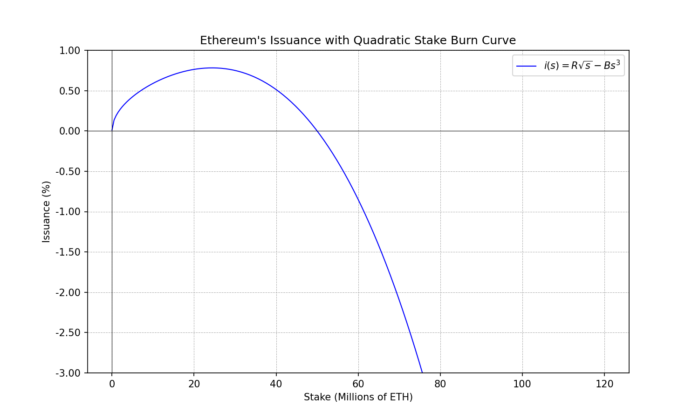

# Curve Analysis

We provide an analysis of different Ethereum yield curves (resp. issuance curves) along a number of different dimensions to characterize the trade-offs associated to each of them.

## Criteria

### Risk Premia Coverage
  
In this criterion we determine what is the range of risk premia that the curve covers. And if it can match any risk premia in that range to a stake ratio univocally. This allows us to understand the curve behavior under 2 different pathological regimes.

- A curve that does not cover a range of risk premium that the market may demand can cause runaway stake ratios.
- When a curve assigns the same risk premium to multiple stake ratios, the curve loses the ability to control the stake ratio at that point, small shifts in demand can cause large shifts in stake.

### Characteristic Yield and Issuance Figures

Yields and issuance figures at some significant stake ratios. This is a way to characterize the curve in a few figures that are significant. We will follow an inverse power of 2 count and provide the issuance and yield that the curve provides at:
- 100% stake ratio
- 50% stake ratio
- 25% stake ratio
- 12.5% stake ratio

### Economic incentive alignment

With this criterion we analyze the economic incentives set-up by the curve. Specifically, we will look at micro-incentives and macro-incentives.

#### Micro-Incentives

The consensus layer defines a base_reward that scales as $\frac{1}{\sqrt{s}}$. This base reward provides an economic incentive for validator to fulfill its duties (attestations, block proposals, sync. committees) but also the penalties (missed attestations) are scaled with the base_reward. [1](https://ethereum.github.io/consensus-specs/specs/phase0/beacon-chain/#helpers) [2](https://eth2book.info/capella/part2/incentives/penalties/)

If the curve changes the base_reward and brings it towards 0 it will not only remove the incentive for validators to fulfill their duties but also remove all disincentives that punish misbehavior.

Therefore, curves that bring the base reward towards 0 fail the micro-incentive criterion. While curves that preserve the rewards positive can be considered good candidates.

#### Macro-Incentives

In macro-incentives we consider the effect that the shape of the issuance curve has on the relative profitability of different types of stakers, and the impact it has on centralization. Curves that create a large gap in the real yields observed by different types of stakers should be disfavored over curves that keep the real yields tightly together. This ensures the shape of the issuance curve does not disfavor specific types of stakers at high stake ratios.

## Curves

### Issuance Curves

### Tempered Issuance ($k= 2^{32}$)

**Yield Function:** $y_i (s) = 1 + \frac{2.6 \cdot 64}{\sqrt{s} (1 + \frac{s}{k})}$ 

**Issuance Function:** $i (s) = \frac{2.6 \cdot 64 \cdot \sqrt{s}}{(1 + \frac{s}{k})}$ 

#### Plots

#### Risk Premia Coverage

#### Characteristic Figures

#### Economic Incentive Alignment

##### Micro-Incentives

The tempered issuance curve brings the base reward towards 0 as the stake ratio grows. It fails the micro-incentives criterion as defined above. This occurs because there is only one term in the definition of the issuance (resp. yield curve) and this term goes towards 0 as the stake grows.

##### Macro-Incentives

The tempered issuance curve increases the gap between the real yields observed by solo-stakers and LST holders. This occurs because of 2 reasons. 

## Linear Burn

**Yield Function:** $y_i(s) = R\frac{1}{\sqrt{s}} - Bs$

**Issuance Function:** $i(s) = R \sqrt{s} - Bs^{2}$

#### Plots

#### Risk Premia Coverage

#### Characteristic Figures

#### Economic Incentive Alignment

##### Micro-Incentives

##### Macro-Incentives

## Quadratic Burn

**Yield Function:** $y_i(s) = R\frac{1}{\sqrt{s}} - Bs^2$

**Issuance Function:** $i(s) = R \sqrt{s} - Bs^{3}$

#### Plots

#### Risk Premia Coverage

#### Characteristic Figures

#### Economic Incentive Alignment

##### Micro-Incentives

##### Macro-Incentives

## Baguette Variants (Linear Burn)

Baguette variant curves are defined by capping the negative term to never surpass the issuance. Such that the yield cannot go negative. They share many of the properties with their non-baguette counter-parts, for this reason we will only analyze one example. Which will highlight the main difference and point of concern.

#### Plots

#### Risk Premia Coverage

Issuance yield range: $y_i \in [0, \infty)$. 

It can match any positive risk premium as long as there is no exogenous yield.

#### Characteristic Figures

#### Economic Incentive Alignment

##### Micro-Incentives

##### Macro-Incentives

