# Curve Analysis

We provide an analysis of different Ethereum yield curves (resp. issuance curves) along a number of different dimensions to characterize the trade-offs associated to each of them.

## TL;DR Table

| Curve | Risk Premia Coverage [%] | 1-to-1 map between yield and stake | Preserves yield at target stake ratio | Micro-Incentives | Macro-Incentives |
| --- | --- | --- | --- | --- |  --- |
| Tempered Issuance | ⚠️ $[0.33, \infty)$ | ✅ | ❌ $\dagger$ | ❌ | ❌
| Linear Burn | ✅ $[-4.25, \infty)$ | ✅ | ✅ | ✅ | ✅
| Quadratic Burn | ✅ $[-8.5, \infty)$ | ✅ | ✅ | ✅ | ✅
| Linear Burn Baguette | ✅ $[0, \infty)$ | ❌ $\dagger \dagger$ | ✅ | ✅ | ✅

- $\dagger$ Can be fixed by increasing the yield by a factor of roughly 2.

- $\dagger \dagger$ If risk premium were to fall to 0% yield or lower, small changes in demand could result in large changes in stake ratio.

## Criteria

### Risk Premia Coverage
  
In this criterion we determine what is the range of risk premia that the curve covers. And if it can match any risk premia in that range to a stake ratio univocally. This allows us to understand the curve behavior under 2 different pathological regimes.

- A curve that does not cover a range of risk premium that the market may demand can cause runaway stake ratios.
- When a curve assigns the same risk premium to multiple stake ratios, the curve loses the ability to control the stake ratio at that point, small shifts in demand can cause large shifts in stake.

### 1-to-1 Map Between Yields and Stake

This is a mathematical condition that ensures that the yield curve is well-defined and can perform its role of matching the yield demanded by the market given the risk premium of staking ETH with a single stake ratio.

Curves that do not satisfy could result in small changes in the demand for yield to cause big shifts in the stake.

### Characteristic Yield and Issuance Figures

Yields and issuance figures at some significant stake ratios. This is a way to characterize the curve in a few figures that are significant. We will follow an inverse power of 2 count and provide the issuance and yield that the curve provides at:
- 100% stake ratio
- 50% stake ratio
- 25% stake ratio
- 12.5% stake ratio

These serve to characterize the curve in a few figures.

We will also look at the max issuance and the stake ratio at which it happens.

### Economic incentive alignment

With this criterion we analyze the economic incentives set-up by the curve. Specifically, we will look at micro-incentives and macro-incentives.

#### Micro-Incentives

The consensus layer defines a base_reward that scales as $\frac{1}{\sqrt{s}}$. This base reward provides an economic incentive for validator to fulfill its duties (attestations, block proposals, sync. committees) but also the penalties (missed attestations) are scaled with the base_reward. [1](https://ethereum.github.io/consensus-specs/specs/phase0/beacon-chain/#helpers) [2](https://eth2book.info/capella/part2/incentives/penalties/)

If the curve changes the scaling of the base_reward and brings it towards 0 it will not only remove the incentive for validators to fulfill their duties but also remove all disincentives that punish misbehavior.

Therefore, curves that bring the base reward towards 0 fail the micro-incentive criterion. While curves that preserve the rewards positive can be considered good candidates.

#### Macro-Incentives

In macro-incentives we consider the effect that the shape of the issuance curve has on the relative profitability of different types of stakers, and the impact it has on centralization. Curves that create a large gap in the real yields observed by different types of stakers should be disfavored over curves that keep the real yields tightly together. This ensures the shape of the issuance curve does not disfavor specific types of stakers at high stake ratios.

## Curves

### Tempered Issuance ($k= 2^{25}$)

**Yield Function:** $y_i (s) = 1 + \frac{2.6 \cdot 64}{\sqrt{s} (1 + \frac{s}{k})}$ 

**Issuance Function:** $i (s) = \frac{2.6 \cdot 64 \cdot \sqrt{s}}{(1 + \frac{s}{k})}$ 

#### Plots

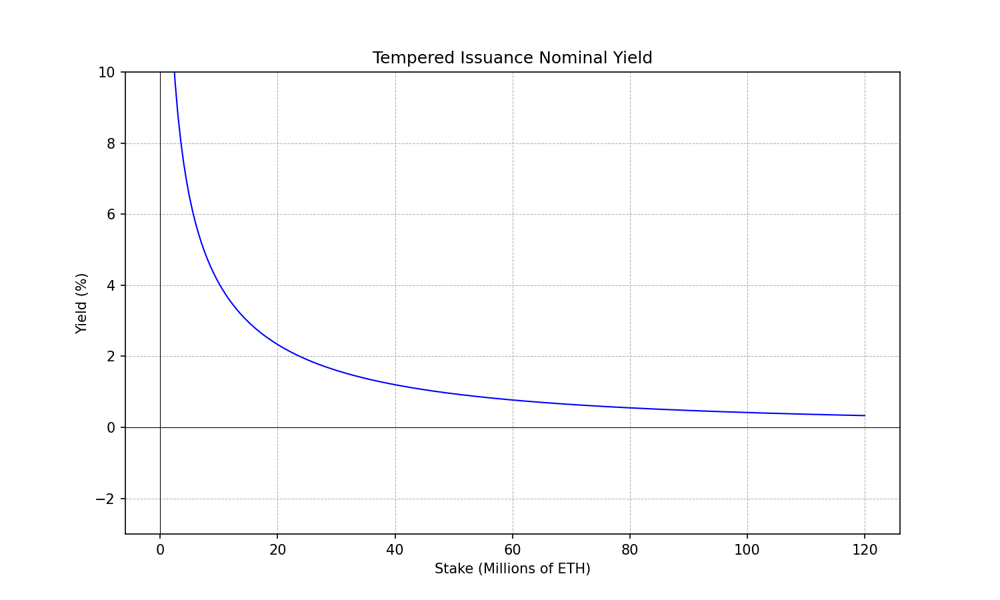

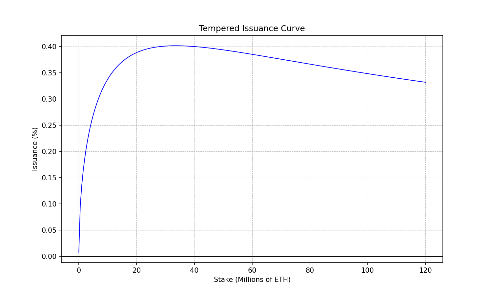

#### Risk Premia Coverage

Issuance yield range: $y_i \in [0.3\%, \infty)$. 

It can match any risk premium above ~0.3%. 

#### 1-to-1 Map Between Yields and Stake

The tempered issuance curve satisfies this mathematical property that ensures the curve can do its job of assigning stake ratios univocally given the demanded risk premium.

#### Characteristic Figures

| Metric | 12.5% | 25% | 50% | 100% |
| --- | --- | --- | --- | --- |
| Yield | 3% | 1.6% | 0.7% | 0.33% |
| Issuance | 0.38% | 0.4% | 0.35% | 0.33% |

Note that this would result in a significant drop in the yield provided at the moment of introduction given current stake ratio is near ~30%.

#### Economic Incentive Alignment

##### Micro-Incentives

The tempered issuance curve brings the base reward towards 0 as the stake ratio grows. It fails the micro-incentives criterion as defined above. This occurs because there is only one term in the definition of the issuance (resp. yield curve) and this term goes towards 0 as the stake grows.

##### Macro-Incentives

The tempered issuance curve presents a large gap between the real yields observed by solo-stakers and LST holders. Adopting the tempered issuance curve would tend to punish more harshly solo stakers.

## Linear Burn

**Yield Function:** $y_i(s) = \underbrace{1.53 \cdot 2.6 \cdot 64 \cdot \frac{1}{\sqrt{s}}}_{\text{rewards}} - \underbrace{5.47 \cdot 10^{-10} \cdot s}_{\text{stake burn}}$

**Issuance Function:** $i(s) = \underbrace{1.53 \cdot 2.6 \cdot 64 \cdot \sqrt{s}}_{\text{rewards}} - \underbrace{5.47 \cdot 10^{-10} \cdot s^{2}}_{\text{stake burn}}$

#### Plots

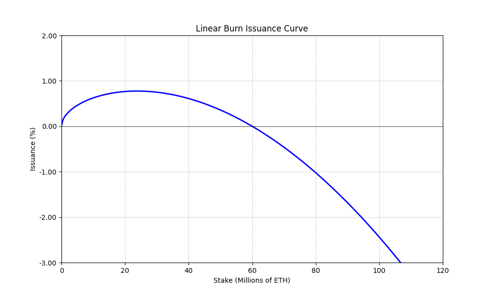

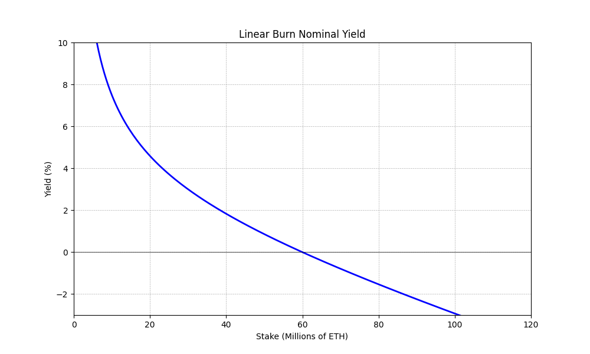

#### Risk Premia Coverage

Issuance yield range: $y_i \in [\underbrace{-4.25\%}_{-y_e^{max}}, \infty)$. 

It can match any risk premium as long as the exogenous yield remains lower than 4.25%.

#### 1-to-1 Map Between Yields and Stake

The linear burn curve satisfies this mathematical property that ensures the curve can do its job of assigning stake ratios univocally given the demanded risk premium.

#### Characteristic Figures

| Metric | 12.5% | 25% | 50% | 100% |
| --- | --- | --- | --- | --- |
| Yield | 5.74% | 3% | 0% | -4.25% |
| Issuance | 0.72% | 0.75% | 0% | -4.25% |

#### Economic Incentive Alignment

##### Micro-Incentives

The linear burn includes a negative term applied per epoch, which allows to maintain the reward term positive. In fact, the reward term is amplified by roughly ~1.5. Which helps increase the regular and predictable source of income from attestations vs irregular sources of income (e.g., MEV, tips).

The linear burn proposal satisfies the micro-incentives criterion.

##### Macro-Incentives

The gap between the real yields observed by different types of stakers is significantly tighter, due to the implementation of stake capping. Solo stakers can perceive positive real yields up to ~52M ETH staked, while at 60M ETH all stakers start receiving negative real yields from issuance.

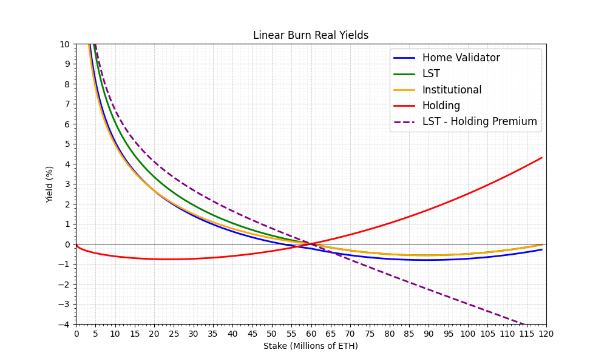

## Quadratic Burn

**Yield Function:** $y_i(s) = \underbrace{1.20 \cdot 2.6 \cdot 64 \cdot \frac{1}{\sqrt{s}}}_{\text{rewards}} - \underbrace{7.18 \cdot 10^{-18} \cdot s^2}_{\text{stake burn}}$

**Issuance Function:** $i(s) = \underbrace{1.20 \cdot 2.6 \cdot 64 \sqrt{s}}_{\text{rewards}} - \underbrace{7.18 \cdot 10^{-18} \cdot s^{3}}_{\text{stake burn}}$

#### Plots

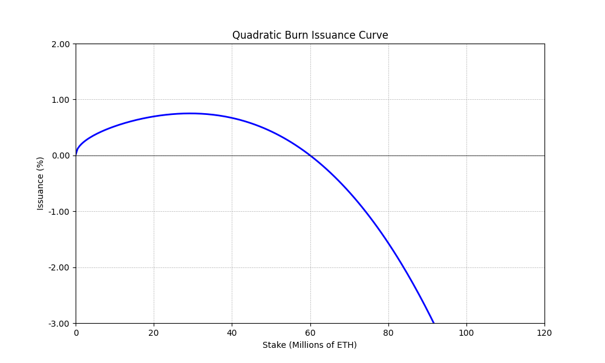

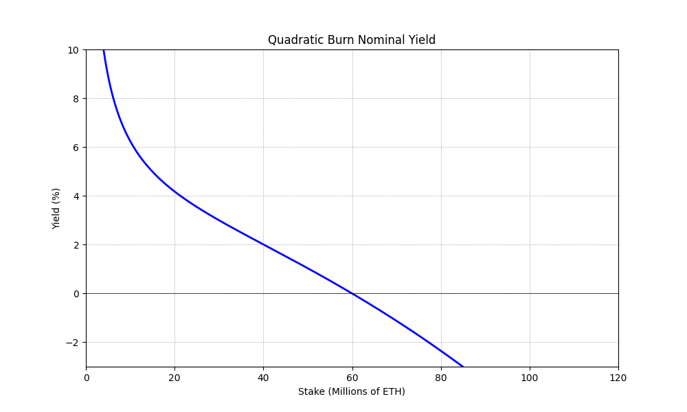

#### Risk Premia Coverage

Issuance yield range: $y_i \in [\underbrace{-8.5\%}_{-y_e^{max}}, \infty)$. 

It can match any risk premium as long as the exogenous yield remains lower than 8.5%.

#### 1-to-1 Map Between Yields and Stake

The quadratic burn curve satisfies this mathematical property that ensures the curve can do its job of assigning stake ratios univocally given the demanded risk premium.

#### Characteristic Figures

| Metric | 12.5% | 25% | 50% | 100% |
| --- | --- | --- | --- | --- |
| Yield | 5% | 3% | 0% | -8.5% |
| Issuance | 0.625% | 0.75% | 0% | -8.5% |

#### Economic Incentive Alignment

##### Micro-Incentives

The quadratic burn includes a negative term applied per epoch, which allows to maintain the reward term positive. In fact, the reward term is amplified by roughly ~1.2. Which helps increase the regular and predictable source of income from attestations vs irregular sources of income (e.g., MEV, tips).

The quadratic burn proposal satisfies the micro-incentives criterion.

##### Macro-Incentives

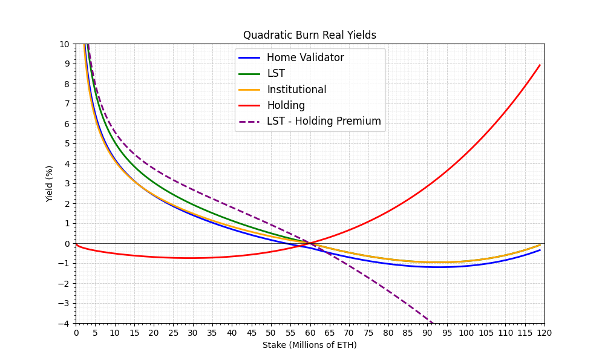

The gap between the real yields observed by different types of stakers is significantly tighter, due to the implementation of stake capping. Solo stakers can perceive positive real yields up to ~53M ETH staked, while at 60M ETH all stakers start receiving negative real yields from issuance.

**Yield Function:** $y_i(s) = 1.20 \cdot 2.6 \cdot 64 \cdot \frac{1}{\sqrt{s}} - \min(1.20 \cdot 2.6 \cdot 64 \cdot \frac{1}{\sqrt{s}}, 7.18 \cdot 10^{-18} \cdot s^2)$

**Issuance Function:** $i(s) = 1.20 \cdot 2.6 \cdot 64 \sqrt{s} - \min(1.20 \cdot 2.6 \cdot 64 \sqrt{s}, 7.18 \cdot 10^{-18} \cdot s^{3})$

## Baguette Variants (Quadratic Burn Example)

Baguette variant curves are defined by capping the negative term to never surpass the issuance. Such that the yield cannot go negative. They share many of the properties with their non-baguette counter-parts, for this reason we will analyze one of them. Which will highlight the main difference and single point of concern.

#### Plots

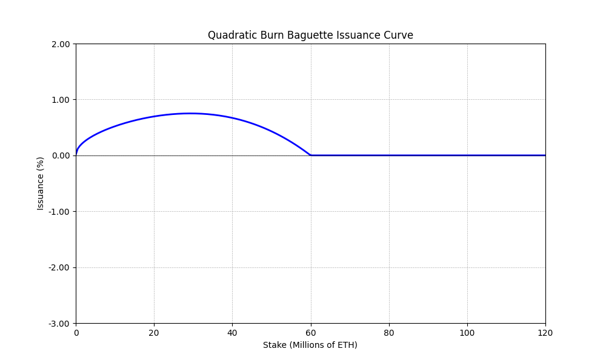

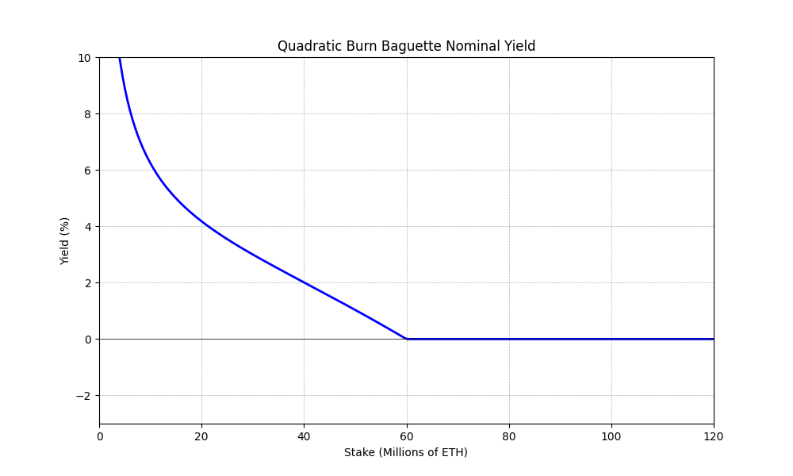

#### Risk Premia Coverage

Issuance yield range: $y_i \in [0, \infty)$. 

It can match any positive risk premium as long as there is no exogenous yield.

#### 1-to-1 Map Between Yields and Stake ⚠️ 

The baguette variant curves do NOT satisfy this mathematical property that ensures the curve can do its job of assigning stake ratios univocally given the demanded risk premium.

The main point of concern is that if the risk premium were to fall to 0% or lower this type of curve is unable to match a single stake ratio. At that point small changes in the demand for yield could result in large changes in the amount of stake.

This concern may be only theoretical if all sources of exogenous yield can be eliminated, but it must be highlighted that the curve is pathological at that point.

#### Characteristic Figures

| Metric | 12.5% | 25% | 50% | 100% |
| --- | --- | --- | --- | --- |
| Yield | 5% | 3% | 0% | 0% |
| Issuance | 0.625% | 0.75% | 0% | 0% |

#### Economic Incentive Alignment

##### Micro-Incentives

Exactly as its non-baguette counter-part it satisfies the micro-incentives criterion.

##### Macro-Incentives

Exactly as its non-baguette counter-part it's able to compress the range of stake ratios where solo-stakers are not economically viable.

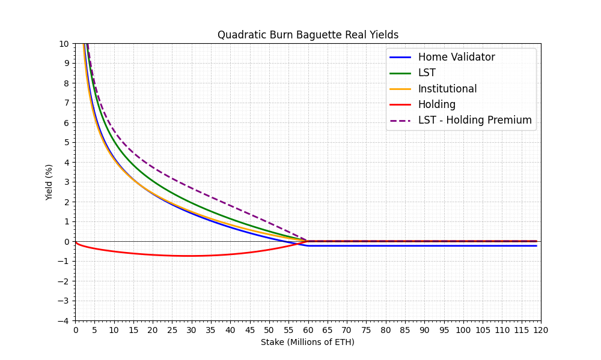
